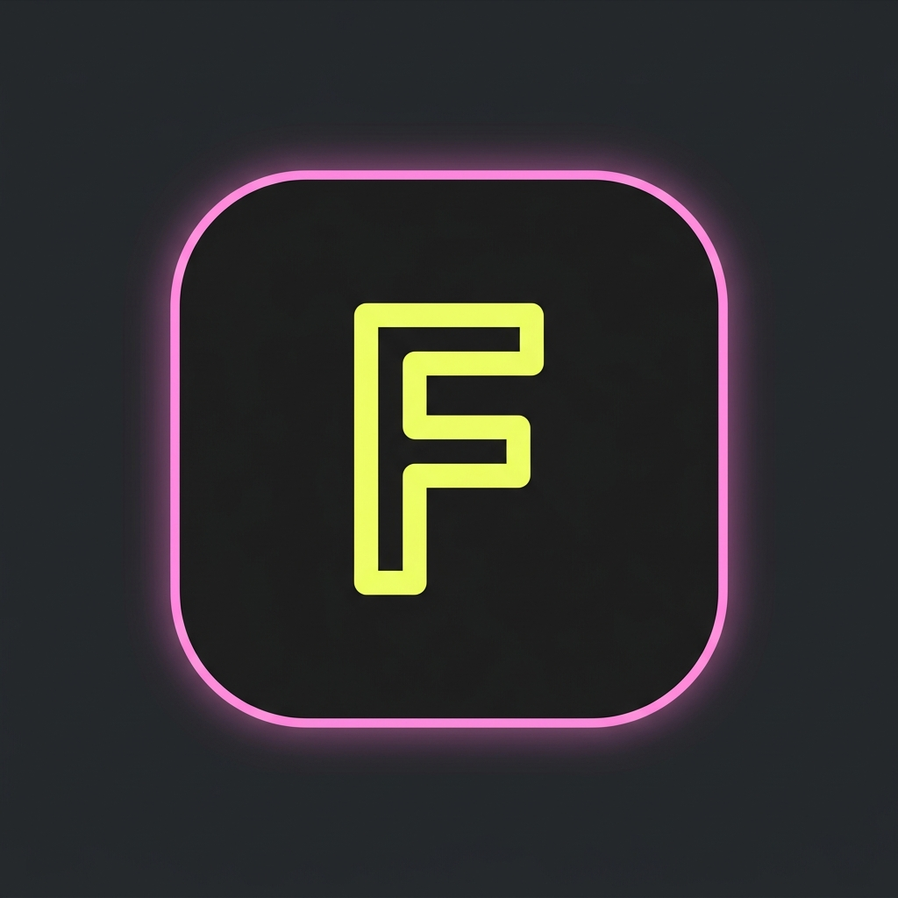

<div align="center">

  

  # FACEO

  ### **Zero-lag, minimalist, burn-after-meeting video calling.**

  [](https://flutter.dev)
  [](https://dart.dev)
  [](https://firebase.google.com)
  [](https://developer.android.com)
  [](https://apple.com)

</div>

---

## ⚡ Overview

**FACEO** is an ultra-minimalist, high-performance ephemeral video calling application built with Flutter, Firebase, and ZegoCloud. 

Modern meeting platforms are overloaded with cognitive noise: endless sidebars, complex grid controls, reaction emojis, and unnecessary background blurring. FACEO strips away all UI bloat to focus on what matters most: **pure stream latency, rock-solid connection resilience, and absolute privacy.**

Every meeting in FACEO is strictly **ephemeral**. Rooms self-destruct 5 minutes after all participants depart, leaving zero logs, zero persisted artifacts, and zero recurring server costs.

---

## 🔥 Key Features

### 📡 Audio-First Fallback (QoS Hysteresis)
FACEO features a client-side Quality of Service (QoS) hysteresis engine that dynamically adapts to real-world network fluctuations:
- **Fast Degrade:** Immediately switches from high-definition video to a low-bandwidth, high-clarity **Audio-First Overlay** after detecting **2 consecutive poor network signals**.
- **Slow Recovery:** Restores the video stream only after receiving **5 consecutive excellent quality samples**, preventing aggressive video toggling and flickering on unstable cellular networks.
- **On-Device Live Captions:** Powered by Speech-to-Text rendering in Neon Yellow (`#F6FF7F`) directly over the audio fallback card.

### ⚡ Spark-Plan Ephemeral Backend (5-Minute Self-Destruct)
- **Zero Cloud Function Dependency:** Uses a decentralized client-sweeping architecture with Firestore timestamp locking (`emptyAt`) to enforce self-destruct rules without paid backend infrastructure.
- **Security Rule Lockout:** Cloud Firestore and Realtime Database rules reject all read/write attempts to rooms that have been empty for > 5 minutes, guaranteeing hard expiration at the database layer.

### 🎨 Strict Minimalist Design System
FACEO enforces an unwavering visual identity designed for OLED displays and maximum legibility:
- **Deep Black (`#1F1F1F`):** Reduces eye strain and conserves battery.
- **Neon Pink (`#FF95DD`):** Primary interactive actions and main logo border.
- **Neon Yellow (`#F6FF7F`):** Real-time QoS alerts and speech indicators.
- **Periwinkle (`#B7BEFE`):** Secondary controls and subtle typography.
- **Zero 3D & Zero Drop Shadows:** Completely flat aesthetic with 48x48 minimum touch targets and VoiceOver/TalkBack `Semantics` compliance.

---

## 📐 Architecture & Tech Stack

```
   ┌─────────────────────────────────────────────────────────────┐
   │                        FACEO App                            │
   ├──────────────────────────────┬──────────────────────────────┤
   │      Flutter UI Layer        │      Services Layer          │
   │  - HomeDashboard             │  - ZegoService               │
   │  - CallScreen1v1             │  - NetworkQualityService     │
   │  - OnboardingScreen          │  - RoomSweeperService        │
   │  - FaceoLogo                 │  - ActiveSpeakerService      │
   └──────────────┬───────────────┴──────────────┬───────────────┘
                  │                              │
                  ▼                              ▼
   ┌──────────────────────────────┐┌──────────────────────────────┐
   │    Firebase Services         ││     ZegoCloud RTC Engine     │
   │  - Auth (Google & Phone)     ││  - Low-Latency Video Streams │
   │  - Firestore (/rooms)        ││  - Raw Stream Lifecycle      │
   │  - RTDB (/presence, /speaker)││  - Dynamic Audio Toggles     │
   └──────────────────────────────┘└──────────────────────────────┘
```

| Layer | Technology | Purpose |
| :--- | :--- | :--- |
| **Framework** | Flutter (Dart 3.x) | Cross-platform iOS & Android application |
| **RTC Stream** | ZegoCloud Express SDK | Ultra-low latency raw audio/video pipeline |
| **Database** | Firebase Firestore & RTDB | Ephemeral room metadata & low-latency active speaker sync |
| **Auth** | Firebase Authentication | Google Sign-In & OTP Authentication |
| **Captions** | SpeechToText | On-device zero-latency voice transcription |

---

## 🎨 Design System Tokens

| Token Name | Hex Code | Usage |
| :--- | :--- | :--- |
| **Deep Black** | `#1F1F1F` | Primary screen backgrounds |
| **Card Surface** | `#313131` | Container tiles & bottom sheets |
| **Neon Pink** | `#FF95DD` | Primary actions & main logo border |
| **Neon Yellow** | `#F6FF7F` | Logo typography & QoS network banners |
| **Periwinkle** | `#B7BEFE` | Secondary action pills & secondary text |

---

## 🚀 Getting Started

### Prerequisites
- [Flutter SDK](https://docs.flutter.dev/get-started/install) (v3.19.0 or higher)
- Android Studio / Xcode for mobile build targets
- A configured [Firebase Project](https://console.firebase.google.com/)
- A [ZegoCloud Console Account](https://console.zegocloud.com/) with AppID and AppSign

### Installation & Setup

1. **Clone the Repository**
   ```bash
   git clone https://github.com/your-username/FACEO.git
   cd FACEO
   ```

2. **Install Dependencies**
   ```bash
   flutter pub get
   ```

3. **Environment Configuration**
   Copy `.env.example` to `.env` in the project root and fill in your credentials:
   ```env
   ZEGO_APP_ID=123456789
   ZEGO_APP_SIGN=your_zegocloud_app_sign_here
   ```

4. **Firebase Configuration & SHA Fingerprints**
   - Ensure `google-services.json` (Android) and `GoogleService-Info.plist` (iOS) are placed in `android/app/` and `ios/Runner/` respectively.
   - For Android Google Sign-In, add your SHA-1 and SHA-256 fingerprints to the Firebase Console:
     ```bash
     cd android
     ./gradlew signingReport
     ```

5. **Run Static Verification**
   ```bash
   flutter analyze
   ```

6. **Launch the Application**
   ```bash
   flutter run
   ```

---

## 🧪 Verification & Testing

FACEO includes comprehensive test suites for QoS network hysteresis, active speaker synchronization, and room sweeping:

```bash
# Run unit & widget tests
flutter test
```

---

## 🛡️ Security & Privacy

- **Zero Data Retention:** No audio, video, or chat payload is ever logged or saved to persistent disk storage.
- **Hardware Permissions:** Strictly scoped camera (`NSCameraUsageDescription`), microphone (`NSMicrophoneUsageDescription`), and speech recognition (`NSSpeechRecognitionUsageDescription`) manifest tags.

---

<div align="center">

Made with ❤️ by the **FACEO Engineering Team**

</div>
